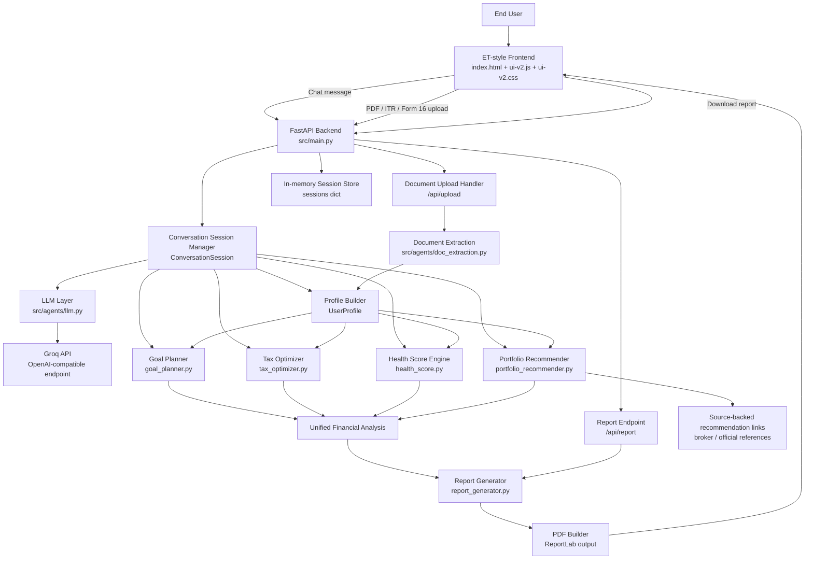

# ET Money Mentor System Architecture

This diagram reflects the current implementation in this repository.

## Component notes

- **Frontend** captures profile answers, uploads documents, renders progress, shows the financial dashboard, and downloads the report.
- **FastAPI backend** exposes the three main endpoints: `/api/chat`, `/api/upload`, and `/api/report`.
- **Conversation session manager** orchestrates onboarding, stores progress in memory, and decides when to trigger analysis.
- **LLM layer** handles conversational understanding, field extraction, reprompts, in-scope answers, and final summary generation using Groq.
- **Document extraction** parses uploaded PDFs and feeds extracted values back into the user profile.
- **Financial engines** compute the health score, goal milestones, tax comparison, and portfolio recommendation.
- **Report generator** produces the final structured advisory output and exports a PDF for download.

## Current deployment shape

- **Runtime**: single-process local FastAPI app
- **State**: in-memory session storage
- **LLM provider**: Groq via OpenAI-compatible API
- **Document parsing**: local PDF text extraction
- **Report output**: generated PDF file returned by the backend
